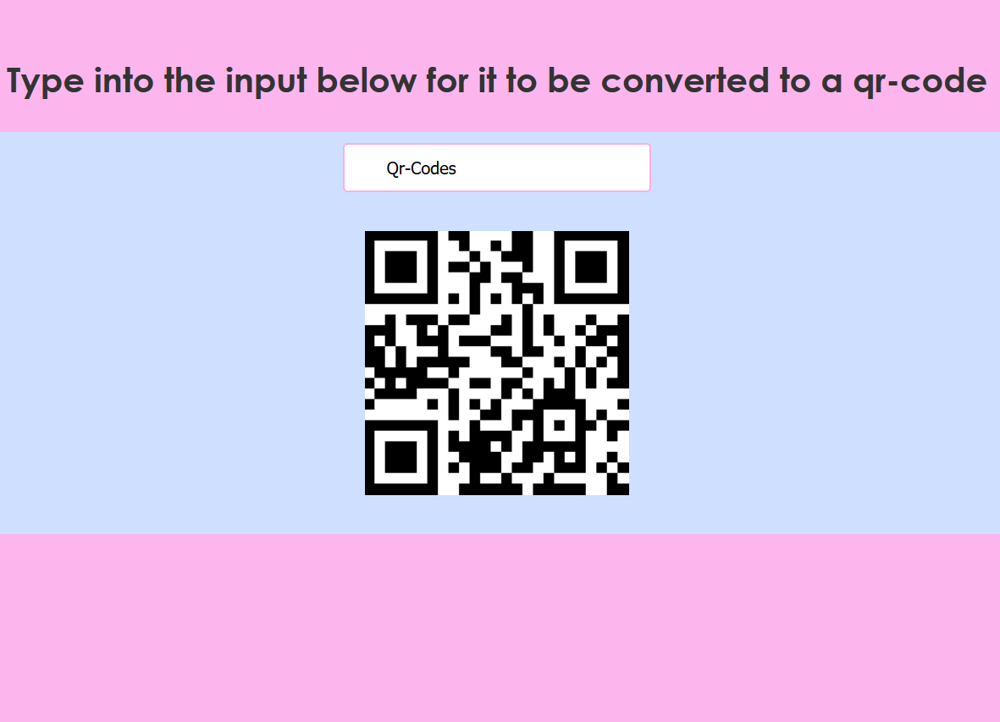

# QR-Code Converter
This is a program that takes text in a textbox and converts it into a Qr-code that contains the information of the text.

QR-codes are useful for transporting small amounts of text data such as URLs and usernames from one source to another device with a camera.
### Below is an image of the website

