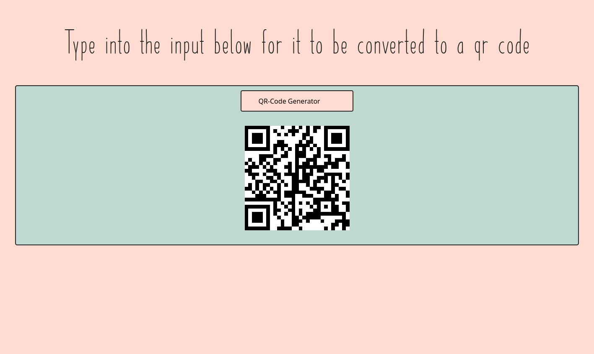

# QR-Code Converter

## Table of contents
* [Overview](#overview)
* [Examples](#examples)
* [Technologies](#technologies)
* [Usage](#usage)
* [Limitations](#limitations)

## Overview
This is a program that takes text from a textbox and automatically converts it into a Qr-code that contains the information of the text.

## Examples

> Screenshot of the website

## Technologies
- **HTML / CSS**
- **JavaScript**
- **QR-Code Generator API**

## Usage
The project is hosted [here](https://alex0blackwell.github.io/pages/qrCode/index.html) or find it in the *portfolio* section of my [website](https://alex0blackwell.github.io/)!

## Limitations
- QR-codes can only represent text

## License
Licensed under the [GNU General Public License v3.0](LICENSE)
